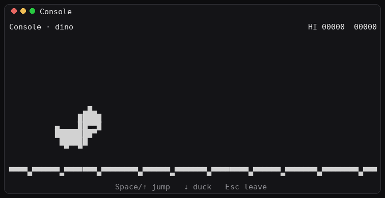

# Console

**Console** is a small multi-game terminal you open while [Hermes Agent](https://hermes-agent.nousresearch.com/) is running. Type `/console` and play Chrome's offline dinosaur (`chrome://dino`) while a long `/goal` keeps working.



| | |
| --- | --- |
| Product name | **Console** |
| Plugin slug | `console` |
| Slash command | `/console` |

v1 is Hermes + dino. Later games can register behind the same `/console` door. No network, no telemetry, no secrets. Tool calls never move the dino.

The GIF above is real engine output (scripted jumps, same renderer as the TUI). Recreate it with `python3 scripts/record_dino_gif.py` (needs Pillow; ffmpeg optional).

## Install

Prefer the GitHub install, then restart Hermes:

```bash
hermes plugins install Takumixbt/Console --enable
```

`/help` should list `/console`.

Symlink fallback (local checkout):

```bash
mkdir -p ~/.hermes/plugins
ln -sfn /absolute/path/to/this/repo ~/.hermes/plugins/console
hermes plugins enable console
```

The folder name should be `console` so it matches `plugin.yaml`. Enable with the slug `console` even if a checkout is named `Console`.

Or in `~/.hermes/config.yaml`:

```yaml
plugins:
  enabled:
    - console
```

Needs Python 3.10+ and a real TTY. Gateway / Discord / Telegram print a short CLI-only message.

## Try it

1. Start Hermes in a terminal.
2. Start a long `/goal`.
3. Type `/console`.
4. Space or Up to jump. Esc returns to Hermes (pauses the run if the agent is still going).

Standalone, without Hermes:

```bash
python3 -m console_dino
# or: python3 -m console
# smoke test: python3 -m console_dino --headless --frames 180 --script jump@0
```

## Controls

| Key | Action |
| --- | --- |
| `Space` or `Up` | Start, jump, or restart after game over |
| `Down` | Duck on the ground; fast-fall in the air |
| `Esc` | Leave Console. Pauses the run, or wipes it if **TASK DONE** was showing |

## Task-done banner

When a Hermes run looks finished, Console draws **✓ TASK DONE** and freezes new obstacle spawns. Hooks only write `~/.hermes/console.state`. They do not drive gameplay.

Best-effort signals: `on_session_end` (`completed=true`), plus `pre_command` on `/goal` to mark busy. Hermes has no dedicated goal-finished hook. Force the banner for a test:

```bash
mkdir -p ~/.hermes
printf '{"schema":1,"task_done":true,"wipe_on_escape":true}\n' > ~/.hermes/console.state
```

Then `/console` or `python3 -m console_dino`. Esc after the banner clears the paused snapshot.

## Layout

```
plugin.yaml          # Hermes manifest (name: console)
__init__.py          # register(ctx): plugin root
console/             # engine, /console handler, dino game
console_dino/        # python -m console_dino
docs/console-dino.gif
```

Add another game under `console/games/`, decorate with `@register("name")`, and launch it with `/console <name>`.

## Development

```bash
python3 -m pip install -e ".[dev]"
python3 -m pytest
python3 -m console_dino --headless --frames 120 --script jump@0
```
