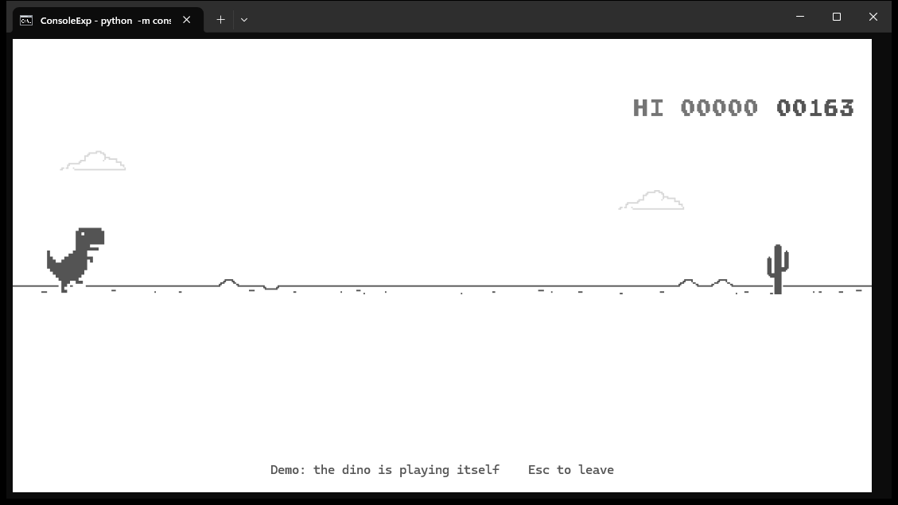

# Console

Chrome's dino game, inside your terminal, one keypress away from [Hermes Agent](https://hermes-agent.nousresearch.com/).


It is not a lookalike. The game is a line-for-line Python port of the dino source in Chromium, drawn with Chrome's own sprite sheet and played with Chrome's own sounds. The physics, obstacle spawning, pterodactyls, night mode, score flashes, the game-over button animation and the high score all come from the original code, and the port is checked against a real Chrome 154 (see [How it is verified](#how-it-is-verified)).



## Install

You need Python 3.10+ and a terminal that can draw sixel graphics. **Windows Terminal 1.22 or newer** does; so do WezTerm, iTerm2 and foot. There are no Python dependencies.

Into Hermes:

```bash
hermes plugins install Takumixbt/Console --enable
```

Restart Hermes. `/help` should now list `/console`.

From a local checkout on Windows, a directory junction is enough (no admin rights needed):

```powershell
$dst = "$env:LOCALAPPDATA\hermes\plugins\console"
New-Item -ItemType Directory -Force -Path (Split-Path $dst) | Out-Null
cmd /c mklink /J "$dst" "C:\path\to\Console"
hermes plugins enable console
```

## Playing

| | |
| --- | --- |
| `/console` | open the game inside Hermes |
| `Ctrl+O` | open it any time, **even while the agent is working** |
| `Space` or `Up` | start, jump (hold for a higher jump), restart after game over |
| `Down` | duck, or drop fast in mid-air |
| `Enter` | restart straight away after game over |
| `Esc` | back to Hermes |

Hermes only runs a slash command once the agent is idle, so a `/console` typed mid-run would wait in the queue. `Ctrl+O` is bound straight into Hermes' prompt, so it opens the game immediately. While you play, anything the agent prints is held back and shown when you leave, and a line under the game tells you when it is working and when it has finished. Leaving pauses the game like a blurred Chrome tab; opening it again resumes the same run.

Set `CONSOLE_HOTKEY` (for example `c-g`) to use a different key, and `CONSOLE_SOUND=0` to mute the sounds. Your high score is kept in `console.json` next to the rest of Hermes' files.

Without Hermes:

```bash
python -m console            # play
python -m console --demo     # watch it play itself
python -m console --list     # available games
```

## Troubleshooting

- *"this terminal did not say it supports sixel"*: use Windows Terminal 1.22+ (or WezTerm, iTerm2, foot). `CONSOLE_SIXEL=1` forces it on if your terminal supports sixel but does not announce it.
- *The picture is small*: it is drawn at the largest whole-number scale that fits, so every game pixel stays square. Enlarge the window or lower the font size and it grows.
- *Choppy*: `python -m console --debug` prints the frame rate and where the time goes under the picture.

## How it is verified

`tools/chrome_trace.mjs` runs the real dino page in headless Chrome under a fake clock and a seeded random generator, lets a bot play it, and hashes every canvas call and a snapshot of the game state for every frame. `tools/replay_trace.py` feeds the same inputs through the Python port and compares. About 100,000 frames, covering restarts, night mode, pterodactyls and high scores, match exactly. Three short traces are committed in `tests/fixtures/` and run with the test suite.

```bash
python -m pip install -e ".[dev]"
python -m pytest                                             # includes the Chrome parity tests (about 2 minutes)
node tools/chrome_trace.mjs --frames 20000 --out trace.json  # needs Chrome and Node 22+
python tools/replay_trace.py trace.json
```

## Layout

```
plugin.yaml, __init__.py   Hermes plugin entry
console/hermes_plugin.py   /console, the hotkey, the "agent is working" line
console/runner.py          the screen loop (layout, keys in, pictures out)
console/terminal.py        console input with real key-up, probing, background writer
console/gfx/               PNG decoder, canvas, sixel encoder
console/games/dino/        the port of Chromium's dino game, plus sounds and a demo autopilot
tools/                     the Chrome trace recorder and the replay checker
```

Another game plugs in under `console/games/` with the `@register("name")` decorator and opens with `/console <name>`.

## Credits

The sprites, sounds and game logic come from the Chromium project (BSD 3-clause, see `NOTICE`). Console itself is MIT.
